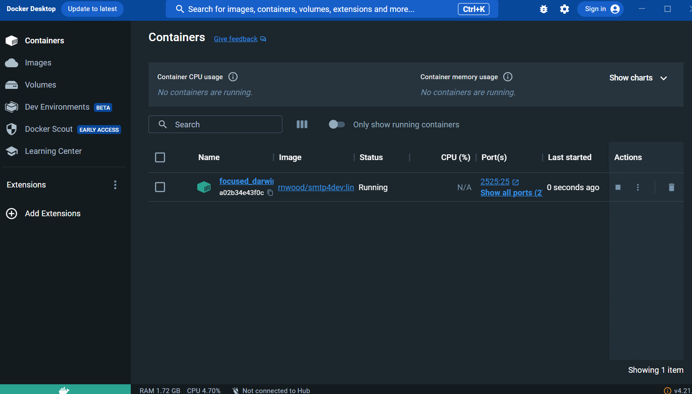

# Elsa Studies

Projeto desenvolvido para estudos e demonstrações da utilização da ferramenta [Elsa Workflow v2 (2.12)](https://v2.elsaworkflows.io/) 

## Dependências

[.NET 6](https://dotnet.microsoft.com/pt-br/download/dotnet/6.0) 

[Docker](https://www.docker.com/)

## Setup

1. Servidor SMTP local ([smtp4dev](https://github.com/rnwood/smtp4dev))

    ```docker run -p 3000:80 -p 2525:25 rnwood/smtp4dev:linux-amd64-3.1.0-ci0856 ```

    Vá até o Docker Desktop e verifique se o servidor está rodando, senão inicie-o

    

2. Verifique se o arquivo ```appsettings.Development.json``` está configurado corretamente

3. Inicie o projeto

    Dentro da pasta ```ElsaStudies.Server.Dashboard``` deste projeto execute o comando ```dotnet run```

4. A aplicação deve estar disponível em ```https://localhost:7127/```